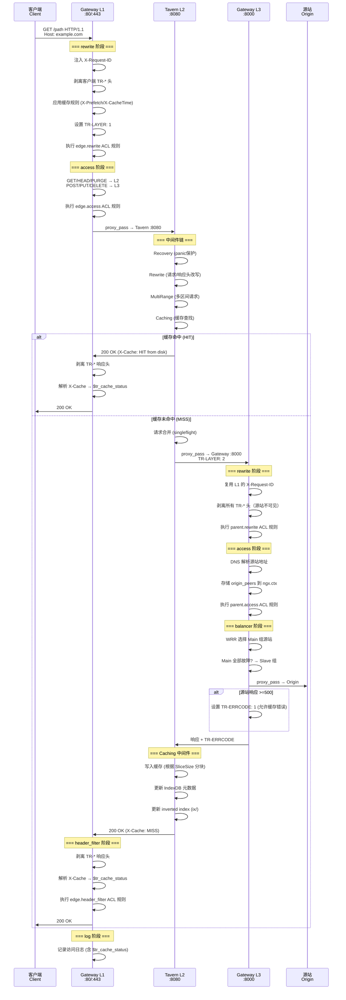

# Tavern CDN 生态概览 / Tavern CDN Ecosystem Overview

> **Tavern CDN** 是一个由 **OpenResty 网关** (Gateway) + **Go 缓存代理** (Tavern) 构成的二层 CDN 缓存架构。
> 整个系统通过 `TR-LAYER` 内部协议实现 L1 (前端) → L2 (缓存) → L3 (回源) 三层逻辑分层，
> 而物理上仅由两个二进制组件实现。

---

## 1. 架构总览 / Architecture Overview

```
Client ──→ [ L1 Gateway ] ──→ [ L2 Tavern Cache ] ──→ [ L3 Gateway ] ──→ Origin
              :80/:443              :8080                    :8000
              (OpenResty)          (Go Binary)              (OpenResty)

              └──────────────── 同一 OpenResty 实例 ─────────────────┘
```

| 层级 / Layer | 内部标识 / Internal Name | 组件 / Component | 职责 / Role |
|:---|:---|:---|:---|
| **L1** | `"1"` (TR-LAYER: absent/1) | **Gateway** (OpenResty) | TLS 终结、Header 清洗、请求路由、认证授权、缓存规则注入 |
| **L2** | — | **Tavern** (Go) | HTTP 缓存核心：缓存查找/存储、对象管理、回源代理、Range 支持 |
| **L3** | `"3"` (TR-LAYER: 2) | **Gateway** (OpenResty) | 源站负载均衡 (WRR + 故障转移)、错误标注、上游 Keepalive |

### 关键设计洞察 / Key Design Insights

1. **三层的物理简化 / Physical Simplicity**: L1 和 L3 运行在**同一个 OpenResty 进程**中，通过 `TR-LAYER` 请求头进行逻辑分离。L1 监听 `:80/:443`，L3 监听 `:8000`。

2. **TR-* 安全边界 / Security Boundary**: 所有 `TR-*` 头在客户端入口处被剥离，在响应返回客户端前再次剥离。这些头只在 Gateway ↔ Tavern 内部流动。

3. **LSM-Tree 索引 / LSM-Tree Index**: Tavern 使用 PebbleDB (LSM-Tree) 作为缓存元数据索引，规避了传统 CDN 海量小文件场景下内存率先耗尽的问题。

---

## 2. 全链路请求流程 / Full Request Lifecycle



---

## 3. 组件职责矩阵 / Component Responsibility Matrix

| 能力 / Capability | Gateway (L1) | Tavern (L2) | Gateway (L3) |
|:---|:---:|:---:|:---:|
| TLS 终结 / TLS Termination | ✅ | ❌ | ❌ |
| HTTP 缓存 / HTTP Caching | ❌ | ✅ | ❌ |
| 请求合并 / Request Collapsing | ❌ | ✅ | ❌ |
| Range 请求处理 / Range Handling | ❌ | ✅ | ❌ |
| 头部重写 / Header Rewrite | ✅ | ✅ | ❌ |
| 访问控制 (ACL) / Access Control | ✅ | ❌ | ❌ |
| 源站负载均衡 / Origin LB | ❌ | ❌ | ✅ |
| 故障转移 / Failover | ❌ | ❌ | ✅ |
| DNS 解析 / DNS Resolution | ❌ | ❌ | ✅ |
| 错误标注 / Error Annotation | ❌ | ❌ | ✅ |
| Header 安全清洗 / Header Sanitize | ✅ | ❌ | ✅ |
| Prometheus 指标 / Metrics | ❌ | ✅ | ❌ |
| 访问日志 / Access Log | ✅ | ❌ | ❌ |
| 动态 SSL (SNI) / Dynamic SSL | ✅ | ❌ | ❌ |
| 平滑升级 / Graceful Upgrade | ✅ (reload) | ✅ (tableflip) | ✅ (reload) |

---

## 4. 部署拓扑 / Deployment Topology

### Docker Compose (推荐开发环境)

```yaml
# docker-compose.yaml (简化)
services:
  gateway:
    image: openresty/openresty:latest
    ports:
      - "20080:20080"   # L1 HTTP
      - "20443:20443"   # L1 HTTPS
    volumes:
      - ./conf:/etc/nginx/conf.d
    depends_on:
      - tavern

  tavern:
    build: .
    ports:
      - "8080:8080"     # L2 Cache API
    volumes:
      - ./config.yaml:/app/config.yaml
      - cache-data:/cache1

  mock-origin:
    image: nginx:alpine
    ports:
      - "9000:80"       # Mock 源站
```

### 生产环境拓扑 / Production Topology

```
                    ┌────────────────────────────┐
                    │        Gateway 节点         │
                    │  ┌──────────┐ ┌──────────┐ │
Client ──────────────┤→│ L1 :80   │ │ L3 :8000 │←┼───────────── Origin
                    │  │   :443  │ │          │ │
                    │  └──────────┘ └──────────┘ │
                    │         │          ↑        │
                    └─────────┼──────────┼────────┘
                              │          │
                              ↓          │
                    ┌────────────────────┼────────┐
                    │     Tavern 节点     │        │
                    │  ┌──────────┐      │        │
                    │  │ L2 :8080 │──────┘        │
                    │  └──────────┘               │
                    │  ┌──────────────────────┐   │
                    │  │ PebbleDB / NutsDB    │   │
                    │  │ (LSM-Tree 索引)      │   │
                    │  └──────────────────────┘   │
                    │  ┌──────────────────────┐   │
                    │  │ 磁盘桶 / 内存桶      │   │
                    │  │ (Chunked File Store) │   │
                    │  └──────────────────────┘   │
                    └─────────────────────────────┘
```

---

## 5. 技术栈对比 / Tech Stack Comparison

| 维度 / Dimension | Tavern (L2) | Gateway (L1/L3) |
|:---|:---|:---|
| **语言 / Language** | Go 1.25+ (CGO disabled) | Lua (OpenResty) |
| **并发模型 / Concurrency** | Goroutine (CSP) | Nginx 事件驱动 + 协程 |
| **关键依赖 / Key Deps** | PebbleDB, Kratos, Tableflip | OpenResty ≥ 1.21.4 |
| **配置格式 / Config Format** | YAML (单文件) | JSON (每域名一文件) + nginx.conf |
| **平滑升级 / Zero-Downtime** | tableflip (二进制热升级) | nginx -s reload |
| **可观测性 / Observability** | Prometheus + PProf | Access Log (JSON) |
| **存储 / Storage** | LSM-Tree 索引 + 分块文件 | lua_shared_dict (内存) |
| **测试框架 / Test Framework** | go test | Test::Nginx::Socket |

---

## 6. 与经典 CDN 方案的对比 / Comparison with Classic CDN

| 特性 / Feature | Tavern CDN | Squid | ATS (Apache Traffic Server) |
|:---|:---|:---|:---|
| **开发语言** | Go + Lua | C++ | C++ |
| **索引结构** | **LSM-Tree** (PebbleDB) | 内存 Hash 表 | 内存 + 磁盘 Directory |
| **磁盘存储** | 文件系统分块 | ufs/aufs/diskd/rock | **裸盘 Cyclic 写** |
| **冷热分层** | ✅ 原生 Promote/Demote | 需手动配置多存储池 | 原生 Volume 分层 |
| **云原生友好度** | ⭐⭐⭐⭐⭐ | ⭐⭐ | ⭐⭐⭐ |
| **二次开发门槛** | 低 (Go + Lua) | 高 (C++ + eCAP) | 高 (C++ Plugin) |
| **极限 IO 性能** | 中 (文件系统) | 中高 | **极高** (裸盘零拷贝) |
| **海量小文件** | ⭐⭐⭐⭐⭐ | ⭐⭐ | ⭐⭐⭐ |
| **协议兼容性** | 中 (持续完善) | 极高 (20年积累) | 极高 (20年积累) |

### 选型建议 / Selection Guidance

- **API 加速、图床、海量小文件** → **Tavern CDN**：LSM-Tree 索引不受内存限制，Go 技术栈易于维护
- **数十 Tbps 流媒体/大文件** → **ATS**：裸盘写入零拷贝，极限吞吐
- **传统企业代理场景** → **Squid**：稳定性久经考验

---

## 7. 相关文档 / Related Documents

- [生态协议规范 / Protocol Specification](./protocol.md)
- [Tavern 项目文档 / Tavern Project](../tavern/01-project.md)
- [Tavern 功能文档 / Tavern Features](../tavern/02-features.md)
- [Tavern 架构文档 / Tavern Architecture](../tavern/03-architecture.md)
- [Gateway 项目文档 / Gateway Project](../gateway/01-project.md)
- [Gateway 功能文档 / Gateway Features](../gateway/02-features.md)
- [Gateway 架构文档 / Gateway Architecture](../gateway/03-architecture.md)

---

*Document generated: 2026-06-09 | Source: Tavern & Gateway source code analysis*
