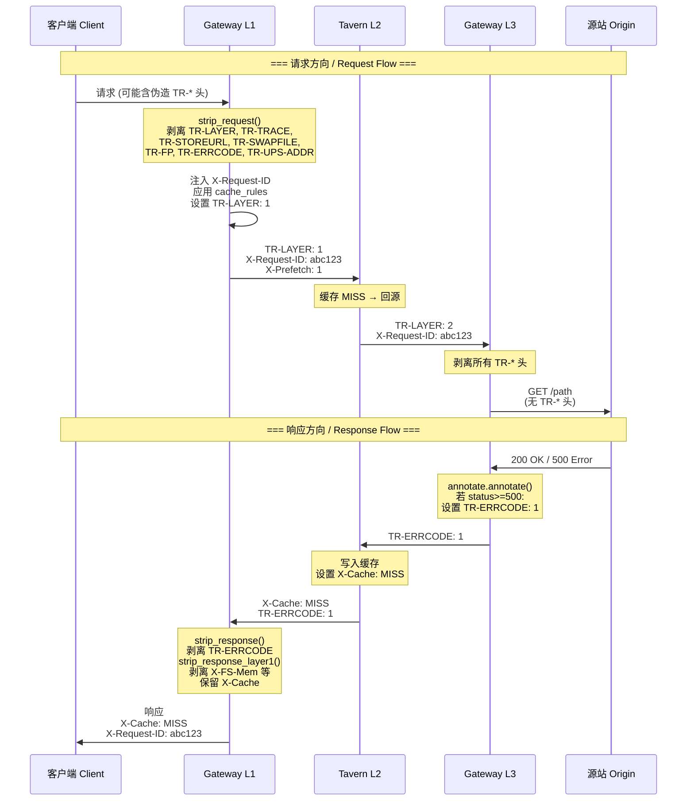
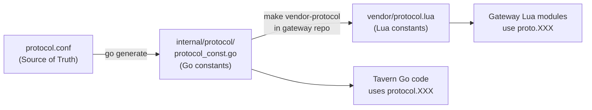

# 协议规范 / Protocol Specification

> **TR-* 和 X-* 内部协议头规范**，定义了 Tavern CDN 生态中 Gateway (L1/L3) 与 Tavern (L2) 之间的完整通信协议。
> 这些协议头仅在内部组件间流通，对外部客户端和源站完全透明。

---

## 1. 协议常量定义 / Protocol Constants

### 来源文件 / Source Files

| 组件 / Component | 文件 / File | 用途 / Purpose |
|:---|:---|:---|
| **Tavern** (Go) | `internal/protocol/protocol.conf` | 协议常量定义源 (Source of Truth) |
| **Tavern** (Go) | `internal/protocol/` (生成) | `go generate` 生成的 Go 常量 |
| **Gateway** (Lua) | `vendor/protocol.lua` | 从 Tavern 自动同步的 Lua 常量 |

### 同步命令 / Sync Command

```bash
# 在 Gateway 仓库中执行
make vendor-protocol

# 这会从 Tavern 的 internal/protocol/ 生成 vendor/protocol.lua
```

---

## 2. 完整协议头列表 / Complete Header Reference

### 2.1 公共协议头 (X-*) / Public Protocol Headers

这些头部在响应中**可以对客户端可见**（X-Cache 尤其重要），但请求中的这些头部会被网关处理。

| Header | 常量名 (Go) | 常量名 (Lua) | 方向 / Direction | 用途 / Purpose |
|:---|:---|:---|:---|:---|
| `X-Request-ID` | `ProtocolRequestIDKey` | `ProtocolRequestIDKey` | L1→L2→L3 | 全链路请求追踪 ID |
| `X-Cache` | `ProtocolCacheStatusKey` | `ProtocolCacheStatusKey` | L2→L1→Client | 缓存状态（见下方状态值表） |
| `X-FS-Mem` | `ProtocolForceStoreMemory` | `ProtocolForceStoreMemory` | L1→L2 | 强制将对象存入内存桶 |
| `X-Prefetch` | `ProtocolPrefetchCacheKey` | `ProtocolPrefetchCacheKey` | L1→L2 | 启用缓存预取 |
| `X-CacheTime` | `ProtocolCacheTime` | `ProtocolCacheTime` | L1→L2 | 覆盖缓存 TTL（秒） |

#### X-Cache 状态值 / X-Cache Status Values

| 值 / Value | 常量名 (Go) | 含义 / Meaning |
|:---|:---|:---|
| `MISS` | `CacheMiss` | 缓存未命中，已回源 |
| `HIT` | `CacheHit` | 缓存命中 |
| `PARENT_HIT` | `CacheParentHit` | 父层缓存命中 |
| `PART_HIT` | `CachePartHit` | Range 请求部分命中 |
| `PART_MISS` | `CachePartMiss` | Range 请求部分缺失 |
| `REVALIDATE_HIT` | `CacheRevalidateHit` | 回源校验后命中 (304) |
| `REVALIDATE_MISS` | `CacheRevalidateMiss` | 回源校验后未命中 (200) |
| `HOT_HIT` | `CacheHotHit` | 热数据层命中 |
| `BYPASS` | `BYPASS` | 绕过缓存直回源 |

### 2.2 内部协议头 (TR-*) / Internal Protocol Headers

**这些头部严禁暴露给客户端或源站。** Gateway 在 L1 入口剥离客户端注入的 TR-*，在 L3 出口剥离所有 TR-* 后转发给源站，在 L1 出口再次剥离后返回客户端。

| Header | 常量名 (Lua) | 方向 / Direction | 类型 / Type | 用途 / Purpose |
|:---|:---|:---|:---|:---|
| `TR-LAYER` | `InternalLayerKey` | L1→L2→L3 | `"1"` / `"2"` | 层级标识符 |
| `TR-TRACE` | `InternalTraceKey` | L1→L2 | 任意字符串 | 调试追踪标记 |
| `TR-STOREURL` | `InternalStoreUrl` | L1→L2 | URL 字符串 | 强制覆盖缓存存储 Key |
| `TR-SWAPFILE` | `InternalSwapfile` | L2 内部 | 文件路径 | 交换文件路径（调试用） |
| `TR-FP` | `InternalFillRangePercent` | L3→L2 | 0-100 | Range 填充百分比 |
| `TR-ERRCODE` | `InternalCacheErrCode` | L3→L2 | `"1"` / `"0"` | 缓存错误响应标记 |
| `TR-UPS-ADDR` | `InternalUpstreamAddr` | L1/L2→L3 | `host:port` | 动态源站地址覆盖 |

#### TR-LAYER 值说明 / TR-LAYER Values

| 请求头值 / Header Value | 内部层 / Internal Layer | 含义 / Meaning |
|:---|:---|:---|
| 不存在 / absent | L1 (`"1"`) | 客户端请求 → 前端处理 |
| `"1"` | L1 (`"1"`) | 从 L1 明确转发 → 前端处理 |
| `"2"` | L3 (`"3"`) | 从 L2 (缓存 MISS) → 回源处理 |

> **注意**: TR-LAYER 在 Lua 中值为 `"2"` 时内部层为 `"3"`，这是因为采用了一进制编号（L1=1, L3=3），便于未来扩展。

#### TR-ERRCODE 值说明 / TR-ERRCODE Values

| 值 / Value | Lua 常量 | 含义 / Meaning |
|:---|:---|:---|
| `"1"` | `FlagOn` | 允许 Tavern 缓存此错误响应 |
| `"0"` | `FlagOff` | 不缓存此错误响应（默认） |

---

## 3. Header 安全清洗规则 / Header Sanitization Rules

### 3.1 L1 入口清洗 (客户端 → Gateway) / L1 Ingress Sanitization

**文件：** `lualib/header_sanitize.lua` → `strip_request()`

在 `rewrite_by_lua` 阶段执行，剥离客户端可能注入的 TR-* 头：

```lua
-- 被剥离的头 / Headers stripped:
-- TR-LAYER, TR-TRACE, TR-STOREURL, TR-SWAPFILE,
-- TR-FP, TR-ERRCODE, TR-UPS-ADDR
for _, h in ipairs(proto.INTERNAL_HEADERS) do
    ngx.req.clear_header(h)
end
```

### 3.2 L3 出口清洗 (Gateway → 源站) / L3 Egress Sanitization

**文件：** `unified/dispatch.lua` → `rewrite()` (L3 branch)

```lua
-- 在转发到源站前剥离所有 TR-* 头
for _, h in ipairs(proto.INTERNAL_HEADERS) do
    ngx.req.clear_header(h)
end
```

### 3.3 L1 出口清洗 (Gateway → 客户端) / L1 Egress Sanitization

**文件：** `lualib/header_sanitize.lua` → `strip_response()` + `strip_response_layer1()`

```lua
-- strip_response(): 剥离响应中的 TR-* 头
-- strip_response_layer1(): 剥离 X-FS-Mem, X-Prefetch 等内部协议的 X-* 头
-- 注意: X-Cache 和 X-Request-ID 被保留，对客户端可见
```

---

## 4. Header 流转示意图 / Header Flow Diagram



---

## 5. 协议常量生成流程 / Protocol Generation Flow



### Go 端 / Go Side

```go
// internal/protocol/protocol.conf 格式:
ProtocolRequestIDKey = "X-Request-ID"
ProtocolCacheStatusKey = "X-Cache"
// ...

// go generate 后生成 Go 代码:
package protocol
const ProtocolRequestIDKey = "X-Request-ID"
```

### Lua 端 / Lua Side

```lua
-- vendor/protocol.lua (从 protocol.conf 自动生成):
local _M = {}
_M.ProtocolRequestIDKey = "X-Request-ID"
_M.InternalLayerKey = "TR-LAYER"
_M.InternalTraceKey = "TR-TRACE"
_M.InternalStoreUrl = "TR-STOREURL"
_M.InternalSwapfile = "TR-SWAPFILE"
_M.InternalFillRangePercent = "TR-FP"
_M.InternalCacheErrCode = "TR-ERRCODE"
_M.InternalUpstreamAddr = "TR-UPS-ADDR"

_M.FlagOn  = "1"
_M.FlagOff = "0"

-- 用于安全清洗的完整 TR-* 列表
_M.INTERNAL_HEADERS = {
    "TR-LAYER", "TR-TRACE", "TR-STOREURL",
    "TR-SWAPFILE", "TR-FP", "TR-ERRCODE", "TR-UPS-ADDR",
}

-- 协议中定义的 X-* 头列表
_M.PROTOCOL_HEADERS = {
    "X-Request-ID", "X-FS-Mem", "X-Prefetch", "X-CacheTime",
}
```

---

## 6. 扩展协议指南 / Protocol Extension Guide

### 添加新的内部协议头 / Adding a New Internal Header

1. **更新 `internal/protocol/protocol.conf`** (Tavern 仓库):
   ```
   InternalNewHeader = "TR-NEWHEADER"
   ```

2. **运行 `go generate`** (Tavern 仓库):
   ```bash
   make generate
   ```

3. **同步到 Gateway** (Gateway 仓库):
   ```bash
   make vendor-protocol
   ```

4. **更新安全清洗规则**:
   - 在 Gateway 的 `header_sanitize.lua` 中添加新头的剥离逻辑
   - 在 `vendor/protocol.lua` 中更新 `INTERNAL_HEADERS` 列表

5. **更新本文档**。

---

## 7. 相关文档 / Related Documents

- [生态概览 / Ecosystem Overview](./overview.md)
- [Gateway 架构文档 / Gateway Architecture](../gateway/03-architecture.md) — TR-LAYER 分发详解
- [Tavern 架构文档 / Tavern Architecture](../tavern/03-architecture.md) — 缓存中间件如何使用这些头

---

*Document generated: 2026-06-09 | Source: internal/protocol/protocol.conf, vendor/protocol.lua, gateway DESIGN.md*
