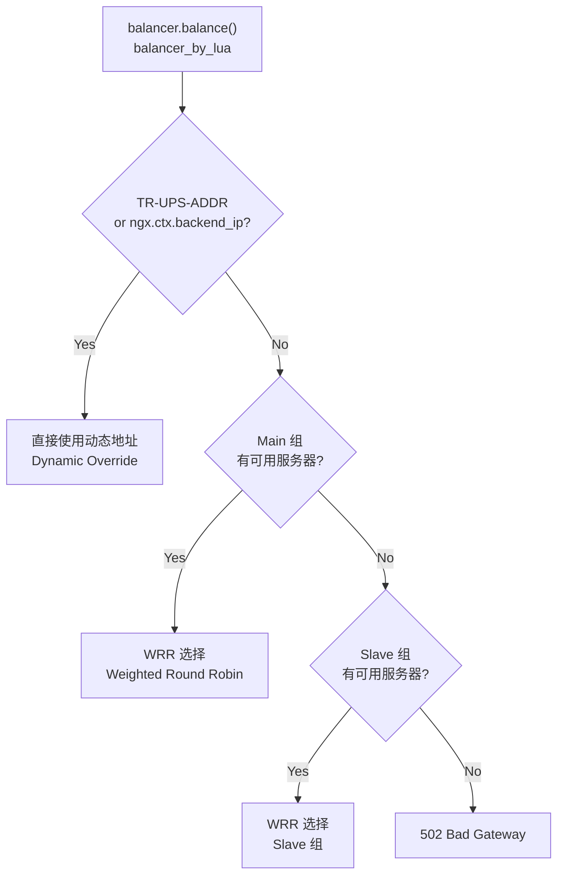

# Gateway 功能文档 / Gateway Features & Requirements

> 本文档描述 Tavern CDN Gateway (OpenResty) 的全部功能能力。
> Gateway 作为 L1 (前端入口) + L3 (回源上游) 的统一网关，处理 TLS 终结、请求路由、访问控制、负载均衡和 Header 安全清洗。

---

## 1. 功能状态矩阵 / Feature Status Matrix

| 功能 / Feature | 层 / Layer | 状态 / Status |
|:---|:---|:---:|
| **TLS 终结 / TLS Termination** | L1 | ✅ |
| **动态 SSL 证书 (SNI) / Dynamic SSL** | L1 | ✅ |
| **Header 安全清洗 / Header Sanitization** | L1 + L3 | ✅ |
| **请求 ID 追踪 / Request ID Tracing** | L1 → L3 | ✅ |
| **缓存规则注入 / Cache Rules Injection** | L1 | ✅ |
| **ACL 访问控制 / ACL Access Control** | L1 + L3 | ✅ |
| **URL 重写 / URL Rewrite** | L1 | ✅ |
| **源站负载均衡 / Origin Load Balancing** | L3 | ✅ |
| **故障转移 / Failover** | L3 | ✅ |
| **故障追踪 / Failure Tracking** | L3 | ✅ |
| **错误标注 (可缓存错误) / Error Annotation** | L3 | ✅ |
| **自定义错误页 / Custom Error Pages** | L1 + L3 | ✅ |
| **域名配置热加载 / Domain Config Hot-reload** | L1 + L3 | ✅ |
| **缓存旁路 (POST/PUT/DELETE) / Cache Bypass** | L1 | ✅ |
| **访问日志 / Access Log** | L1 + L3 | ✅ |

---

## 2. L1 前端功能 / L1 Frontend Features

### 2.1 TR-LAYER 逻辑分层 / TR-LAYER Logical Separation

Gateway 的单个 Nginx 进程包含 3 个 `server {}` 块：

| 监听地址 / Listen | 层 / Layer | 用途 / Purpose |
|:---|:---|:---|
| `:80`, `:20080` | L1 HTTP | 客户端 HTTP 入口 |
| `:443`, `:20443` | L1 HTTPS | 客户端 HTTPS 入口 (SNI 驱动) |
| `:8000` | L3 Internal | Tavern 缓存 MISS 时回源 |

**TR-LAYER 分发：**
- 客户端请求 (TR-LAYER 不存在) → L1 处理
- Tavern 回源请求 (TR-LAYER: 2) → L3 处理

### 2.2 TLS 终止 / TLS Termination

| 特性 / Feature | 详情 / Detail |
|:---|:---|
| **SNI 动态证书** | `ssl_certificate_by_lua` 阶段根据 SNI 动态加载域名证书 |
| **证书配置** | 域名 JSON 的 `ssl.cert` + `ssl.key` + `ssl.chain_cert` |
| **Fallback** | `conf/ssl/fallback.crt` + `fallback.key` (自签名占位) |
| **TLS 版本** | 由 nginx `ssl_protocols` 指令控制 |

**代码路径：** `lualib/ssl_provider.lua`

### 2.3 Header 安全清洗 / Header Sanitization

**文件：** `lualib/header_sanitize.lua`

#### 请求入口清洗 (L1 ingress)

```lua
-- strip_request(): 剥离客户端注入的 TR-* 头
-- TR-LAYER, TR-TRACE, TR-STOREURL, TR-SWAPFILE,
-- TR-FP, TR-ERRCODE, TR-UPS-ADDR
```

#### 响应出口清洗 (L1 egress)

```lua
-- strip_response(): 剥离响应中的 TR-* 头
-- strip_response_layer1(): 剥离内部协议的 X-* 头
--   例外: X-Cache 和 X-Request-ID 保留（对客户端可见）
```

### 2.4 缓存规则注入 / Cache Rules Injection

**文件：** `lualib/cache_rules.lua`

**功能：**
- 根据域名配置向 L1 → L2 请求注入 `X-Prefetch` 头
- 注入 `X-CacheTime` 覆盖缓存 TTL

```lua
cache.apply({
    prefetch   = ngx.var.cache_prefetch == "1" or nil,
    cache_time = tonumber(ngx.var.cache_override) or nil,
})
```

### 2.5 请求路由 / Request Routing

**请求方法路由：**

| 方法 / Method | 目标 / Target | 说明 / Notes |
|:---|:---|:---|
| `GET` / `HEAD` / `PURGE` | L2 (Tavern :8080) | 缓存管线 |
| `POST` / `PUT` / `DELETE` / `PATCH` | L3 (:8000) | 直接回源，旁路缓存 |

---

## 3. L3 回源功能 / L3 Origin Fetch Features

### 3.1 源站负载均衡 / Origin Load Balancing

**文件：** `unified/balancer.lua`

#### 选择流程 / Selection Order



#### 源站配置 / Origin Server Config

```json
{
  "origin": {
    "servers": [
      {
        "type": "main",
        "address": "10.0.0.1",
        "port": 9000,
        "weight": 3,
        "protocol": "https",
        "max_fails": 2,
        "fail_timeout": 15
      },
      {
        "type": "slave",
        "address": "10.0.1.1",
        "port": 9000,
        "weight": 1,
        "protocol": "http",
        "max_fails": 2,
        "fail_timeout": 60
      }
    ],
    "balance_strategy": "round_robin"
  }
}
```

| 字段 / Field | 默认 / Default | 说明 / Notes |
|:---|:---|:---|
| `type` | `"main"` | `"main"` 或 `"slave"` — Slave 仅在 Main 全部故障时使用 |
| `address` | (必需) | IP 或主机名 (在 `access_by_lua` 中 DNS 解析) |
| `port` | (必需) | 源站端口 |
| `weight` | `1` | WRR 权重 |
| `protocol` | `"http"` | `"http"`, `"https"`, 或 `"follow"` (镜像客户端协议) |
| `max_fails` | `3` | 连续失败次数阈值 |
| `fail_timeout` | `30` | 故障服务器下线时长 (秒) |

### 3.2 协议选择 / Protocol Selection

| `protocol` | 行为 / Behavior |
|:---|:---|
| `"http"` | 纯 TCP 到源站 |
| `"https"` | TLS 到源站 (SNI = 服务器地址) |
| `"follow"` | 镜像客户端请求协议 (`ngx.ctx.scheme`) |

### 3.3 故障追踪 / Failure Tracking

**文件：** `unified/balancer.lua` → `register_failure()` / `register_success()`

```
Per-worker, in-memory tracking:
  - upstream_status >= 500 或连接错误 → 递增失败计数
  - 失败计数 ≥ max_fails → 服务器标记为 DOWN (持续 fail_timeout 秒)
  - 首次成功响应 → 重置失败计数
  - 在 log_by_lua 阶段记录 (此时 upstream_status 已知)
```

### 3.4 错误标注 / Error Annotation

**文件：** `lualib/error_annotate.lua`

```lua
-- header_filter 阶段执行
-- 若源站响应状态码 >= 500，设置 TR-ERRCODE: 1
-- 这通知 Tavern L2 可以缓存此错误响应
function annotate.annotate()
    if ngx.status >= 500 then
        ngx.header[proto.InternalCacheErrCode] = proto.FlagOn  -- "1"
    end
end
```

### 3.5 自定义错误页 / Custom Error Pages

**文件：** `lualib/error_page.lua`

```json
{
  "error_page": {
    "404": "/errors/404.html",
    "500": "/errors/500.html",
    "502": "/errors/502.html",
    "503": "/errors/503.html"
  }
}
```

每个域名可以自定义错误页路径。内置通用 fallback。

---

## 4. ACL 规则引擎 / ACL Rule Engine

### 4.1 条件变量 × 运算符 / Condition Variables × Operators

**文件：** `lualib/acl/condition.lua`

#### 条件变量 / Condition Variables

| 变量 / Variable | 示例 / Example | 可用阶段 / Phases |
|:---|:---|:---|
| `uri` | `/path/to/file` | All |
| `method` | `GET`, `POST` | Rewrite, Access |
| `status` | `200`, `404` | Header/Body Filter, Log |
| `scheme` | `http`, `https` | All |
| `remote_addr` | `10.0.0.1` | All |
| `header.<name>` | `header.X-Auth-Token` | All |
| `arg_<name>` | `arg_page` | Rewrite, Access |
| `cookie_<name>` | `cookie_session` | Rewrite, Access |

#### 运算符 / Operators

| 运算符 / Operator | 类型 / Type | 说明 / Notes |
|:---|:---|:---|
| `eq` / `ne` | 字符串 | 精确匹配 / 不等 |
| `regex` | 字符串 | Lua 模式匹配 |
| `prefix` / `suffix` / `contains` | 字符串 | 子串检查 |
| `gt` / `gte` / `lt` / `lte` | 数值 | `tonumber()` 转换后比较 |
| `cidr` | IP | 仅 `ngx.var.remote_addr` |

#### 组合算子 / Combinators

**文件：** `lualib/acl/operator.lua`

```json
{
  "op": "and",        // "and" (默认) 或 "or"
  "rules": [...]      // 支持嵌套组
}
```

### 4.2 动作类型 / Action Types

**文件：** `lualib/acl/action.lua`

| 动作 / Action | 阶段 / Phases | 效果 / Effect |
|:---|:---|:---|
| `set_header` | Any | 覆盖设置请求/响应头 |
| `add_header` | Any | 追加请求/响应头 |
| `del_header` | Any | 删除请求/响应头 |
| `set_var` | Any | 设置 nginx `ngx.var.<name>` |
| `rewrite_url` | Rewrite | 正则 URL 重写 |
| `redirect` | Any | `301` / `302` 重定向 |
| `allow` | Access | 停止规则、继续处理 (terminal) |
| `deny` | Access | 返回状态码 + 消息 (terminal) |
| `set_storeurl` | Rewrite | 设置 `TR-STOREURL` 缓存存储 Key |
| `set_cachetime` | Rewrite | 设置 `X-CacheTime` 缓存时长 |
| `log_extra` | Log | 添加结构化字段到日志上下文 |

### 4.3 规则示例 / Rule Examples

#### 简单 ACL 规则

```json
{
  "edge": {
    "access": [
      {
        "if": [
          { "var": "remote_addr", "op": "cidr", "value": "10.0.0.0/8" }
        ],
        "action": { "type": "deny", "status": 403, "message": "Forbidden" },
        "comment": "Block internal IP range"
      }
    ]
  }
}
```

#### API 不缓存规则

```json
{
  "edge": {
    "rewrite": [
      {
        "if": [
          { "var": "uri", "op": "regex", "value": "^/api/" },
          { "var": "method", "op": "eq", "value": "GET" }
        ],
        "op": "and",
        "action": { "type": "set_cachetime", "value": "0" },
        "comment": "API: disable caching"
      }
    ]
  }
}
```

#### 安全头注入

```json
{
  "edge": {
    "header_filter": [
      {
        "action": { "type": "add_header", "name": "X-Frame-Options", "value": "DENY" }
      },
      {
        "action": { "type": "add_header", "name": "X-Content-Type-Options", "value": "nosniff" }
      }
    ]
  }
}
```

---

## 5. 域名配置 / Domain Configuration

### 5.1 配置格式 / Config Format

每个域名有一个独立的完整 JSON 文件，放在 `conf/rules/` 下：

```json
{
  "id": "cdn.example.com",
  "hash": "1a3fc2d96f49972e0e9d1f0d8048c8c6",
  "origin": { "servers": [...], "balance_strategy": "round_robin" },
  "ssl": { "cert": "...", "key": "...", "chain_cert": "..." },
  "edge": {
    "rewrite": [...],
    "access": [...],
    "header_filter": [...],
    "log": [...]
  },
  "parent": {
    "rewrite": [...],
    "header_filter": [...],
    "log": [...]
  },
  "error_page": {
    "404": "/errors/404.html",
    "500": "/errors/500.html"
  }
}
```

### 5.2 必需字段 / Required Fields

| 字段 / Field | 说明 / Notes |
|:---|:---|
| `id` | **必需** — 域名 |
| `hash` | **必需** — 文件内容 MD5 (去除 hash 行) |

### 5.3 Hash 验证 / Hash Verification

**文件：** `lualib/config_loader.lua`

```lua
-- 加载时自动验证:
-- 1. 读取原始文件内容
-- 2. 正则移除 "hash": "..." 行
-- 3. ngx.md5(stripped_content) 与嵌入的 hash 比较
-- 4. 不匹配 → WARN 日志 (仍然加载配置)
```

```bash
# 计算/更新配置文件的 hash:
resty -e '
local f = io.open("conf/rules/cdn.example.com.json", "r")
local raw = f:read("*a"); f:close()
local stripped = raw:gsub("\"hash\"%s*:%s*\"[^\"]*\"%s*,?%s*", "")
print(ngx.md5(stripped))
'
```

### 5.4 配置加载方式 / Config Loading

| 方式 / Source | 配置值 / Config | 刷新 / Refresh |
|:---|:---|:---|
| **本地目录** | `GATEWAY_CONFIG_URL=file:///path/to/rules/` | 每次请求时检查 |
| **远程 API** | `GATEWAY_CONFIG_URL=https://api.example.com/config` | `ngx.timer.every` 定时刷新 (30s) |

### 5.5 共享字典 / Shared Dictionaries

**文件：** `conf/gateway.conf`

| 字典 / Dict | 大小 / Size | 用途 / Purpose |
|:---|:---|:---|
| `addr_cache` | 1m | 后端地址缓存 (`tavern`, `layer3`, `origin_host`, `origin_port`) |
| `config_store` | 16m | 域名配置存储 (`domain:<host>`, `hash:<host>`, `__domains__`, `__version__`) |
| `cache_rules` | 1m | 缓存规则扩展 (保留) |

---

## 6. 访问日志 / Access Log

### 日志格式 / Log Format

```
log_format main '$remote_addr - $remote_user [$time_local] '
                '"$request" $status $body_bytes_sent '
                '"$http_referer" "$http_user_agent" '
                '$tr_cache_status '          # HIT/MISS/BYPASS/EXPIRED
                '$upstream_response_time '   # 上游响应时间
                '$request_time '             # 总请求时间
                '$ssl_protocol $ssl_cipher';
```

`$tr_cache_status` 由 `xcache_parser.lua` 从 L2 返回的 `X-Cache` 头解析而来。

---

## 7. 相关文档 / Related Documents

- [Gateway 项目文档 / Gateway Project](./01-project.md)
- [Gateway 架构文档 / Gateway Architecture](./03-architecture.md)
- [生态概览 / Ecosystem Overview](../ecosystem/overview.md)
- [协议规范 / Protocol Specification](../ecosystem/protocol.md)

---

*Document generated: 2026-06-09 | Source: gateway README, DESIGN, source code*
