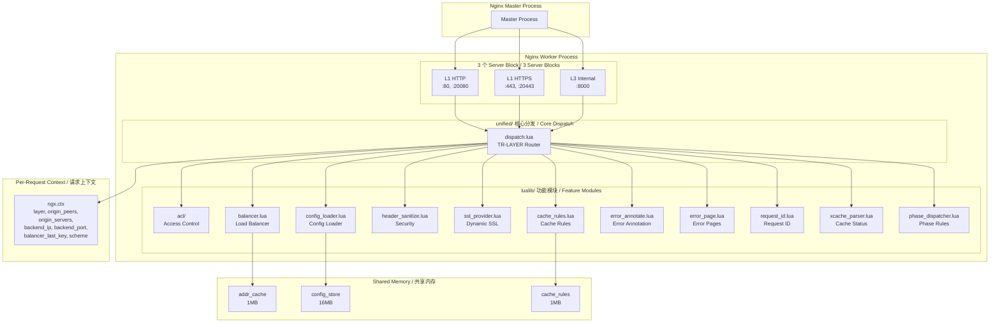
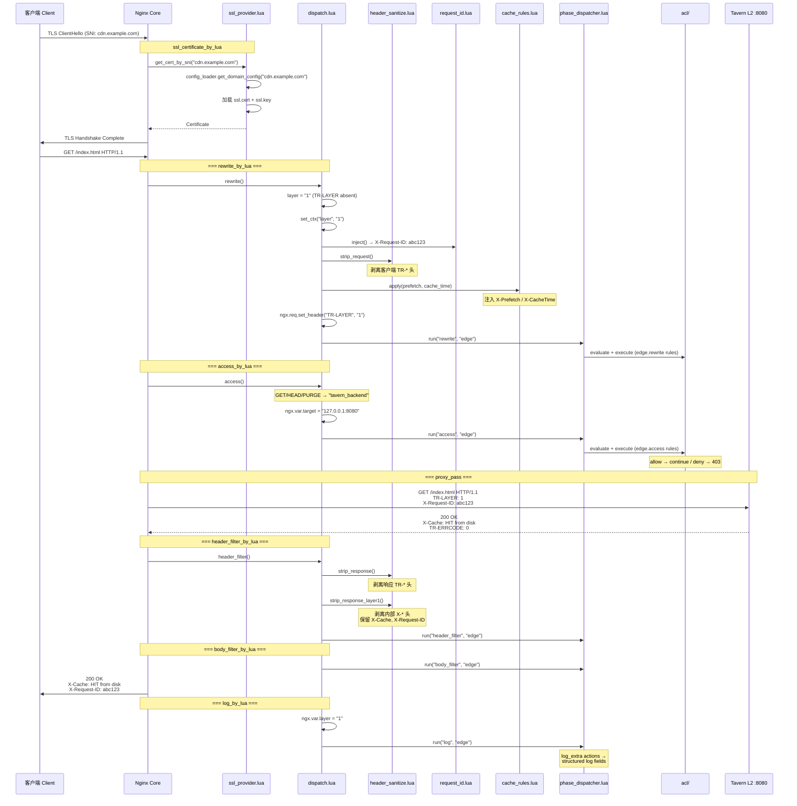
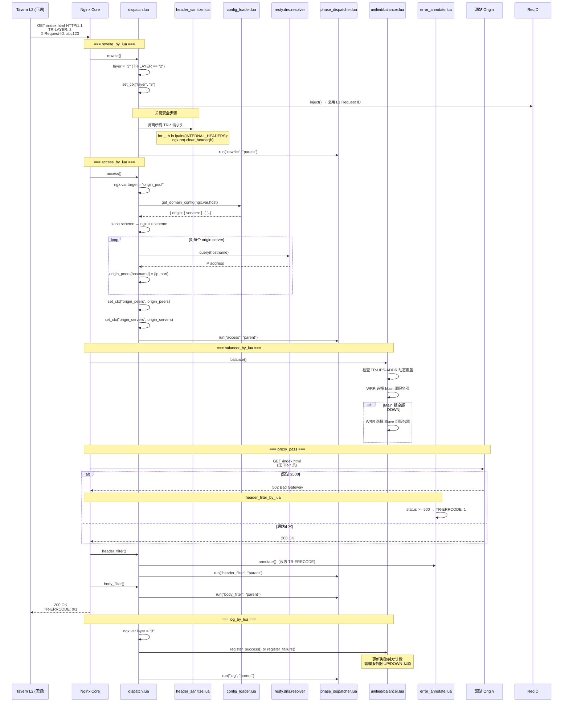
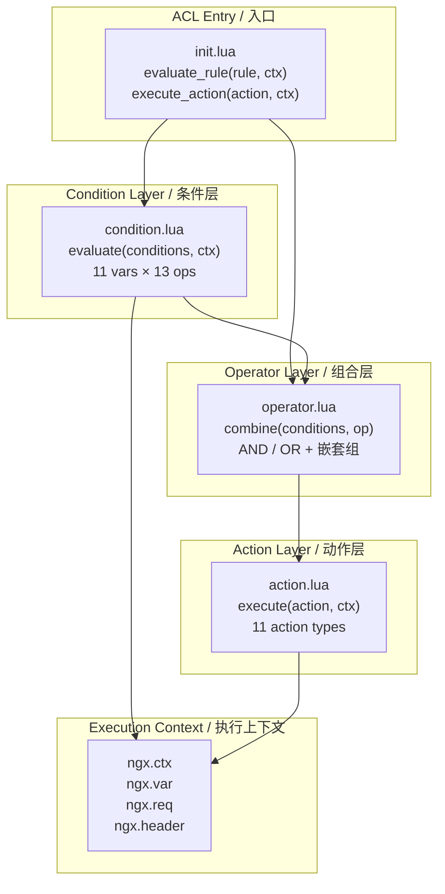
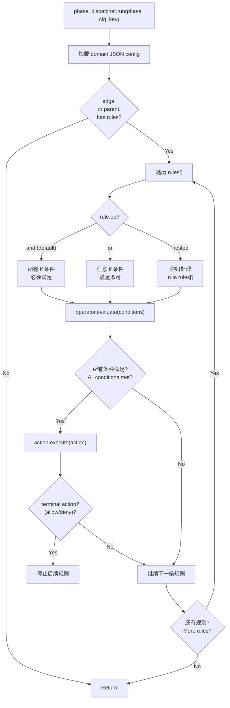
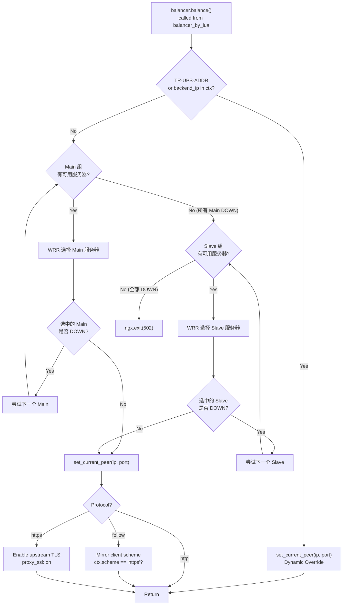
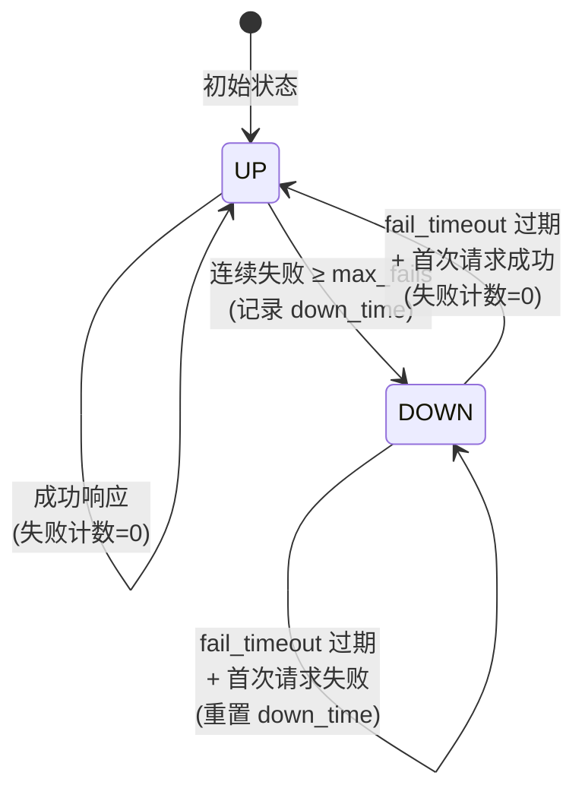
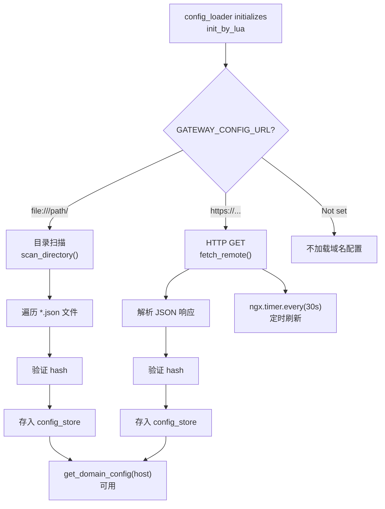
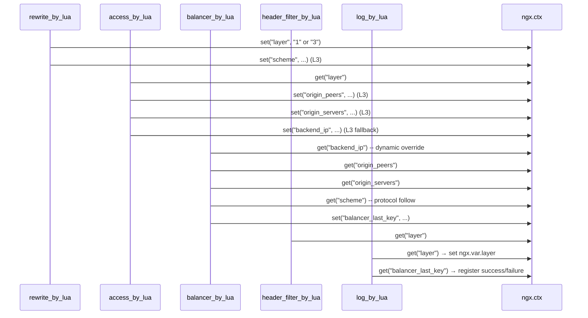

# Gateway 架构文档 / Gateway Architecture Documentation

> 本文档深入描述 Gateway (OpenResty) 的内部架构、TR-LAYER 分发机制、ACL 规则引擎、负载均衡器设计和全链路数据流。

---

## 1. 整体架构 / Overall Architecture



---

## 2. TR-LAYER 分发机制 / TR-LAYER Dispatch Mechanism

### 2.1 核心概念 / Core Concept

Gateway 的核心设计洞察：**一个 Nginx 进程担任两个角色，通过 TR-LAYER 请求头区分。**

| 请求来源 / Request Source | TR-LAYER 值 | 内部层 / Internal Layer | 配置 Key |
|:---|:---|:---|:---|
| 客户端 (外部) | 不存在 / absent | `"1"` (L1 前端) | `"edge"` |
| Tavern L2 (缓存 MISS 回源) | `"2"` | `"3"` (L3 回源) | `"parent"` |

**为什么 `TR-LAYER: "2"` 内部是 `"3"`?**

> 采用一进制编号 (L1="1", L2=Tavern(Go), L3="3")，便于未来扩展新的逻辑层。
> `unified/dispatch.lua` 中的 `LAYER_TO_CFG_KEY` 映射负责转换。

### 2.2 层检测代码 / Layer Detection Code

**文件：** `unified/dispatch.lua:58-66`

```lua
function _M.layer()
    local h = ngx.req.get_headers()[proto.InternalLayerKey]  -- "TR-LAYER"
    if h == "2" then
        return "3"      -- L2 回源请求 → 作为 L3 处理
    end
    return "1"          -- 客户端请求 → 作为 L1 处理
end
```

---

## 3. L1 请求处理全流程 / L1 Request Processing Flow

### 3.1 时序图 / Sequence Diagram



### 3.2 5 个 Nginx Phase 处理 / 5 Nginx Phase Handlers

| Phase | 文件名 / File | 函数 / Function | L1 关键操作 |
|:---|:---|:---|:---|
| `rewrite_by_lua` | `dispatch.lua` | `rewrite()` | 注入 Request ID, 清洗请求头, 缓存规则, 设置 TR-LAYER:1 |
| `access_by_lua` | `dispatch.lua` | `access()` | 路由选择 (L2 或 L3), DNS 解析 |
| `header_filter_by_lua` | `dispatch.lua` | `header_filter()` | 清洗响应头, 解析 X-Cache |
| `body_filter_by_lua` | `dispatch.lua` | `body_filter()` | 响应体过滤 (JSON 规则) |
| `log_by_lua` | `dispatch.lua` | `log()` | 设置 layer 变量, 记录健康状态 |

---

## 4. L3 回源处理全流程 / L3 Origin Fetch Flow



---

## 5. ACL 规则引擎 / ACL Rule Engine

### 5.1 三层架构 / Three-Layer Architecture



### 5.2 规则执行流程 / Rule Execution Flow



### 5.3 条件评估细节 / Condition Evaluation Detail

**文件：** `lualib/acl/condition.lua`

```lua
-- 支持 11 种变量类型
local evaluators = {
    uri           = function(ctx) return ngx.var.uri end,
    method        = function(ctx) return ngx.req.get_method() end,
    status        = function(ctx) return tostring(ngx.status) end,
    scheme        = function(ctx) return ngx.var.scheme end,
    remote_addr   = function(ctx) return ngx.var.remote_addr end,
    header_<name> = function(ctx, name) return ngx.req.get_headers()[name] end,
    arg_<name>    = function(ctx, name) return ngx.var["arg_" .. name] end,
    cookie_<name> = function(ctx, name) return ngx.var["cookie_" .. name] end,
}

-- 支持 13 种运算符
local operators = {
    eq       = function(a, b) return a == b end,
    ne       = function(a, b) return a ~= b end,
    regex    = function(a, b) return ngx.re.match(a, b) ~= nil end,
    prefix   = function(a, b) return string.sub(a, 1, #b) == b end,
    suffix   = function(a, b) return string.sub(a, -#b) == b end,
    contains = function(a, b) return string.find(a, b, 1, true) ~= nil end,
    gt  = function(a, b) return tonumber(a) >  tonumber(b) end,
    gte = function(a, b) return tonumber(a) >= tonumber(b) end,
    lt  = function(a, b) return tonumber(a) <  tonumber(b) end,
    lte = function(a, b) return tonumber(a) <= tonumber(b) end,
    cidr = function(a, b) --[[ IP range check ]] end,
}
```

---

## 6. 负载均衡器 / Load Balancer

### 6.1 架构设计 / Architecture

**文件：** `unified/balancer.lua`



### 6.2 WRR 算法 / Weighted Round Robin

```
示例: Main 组 [A(w=3), B(w=2), C(w=1)]
分配序列: A, A, A, B, B, C, A, A, A, B, B, C, ...

实现:
- 维护每个服务器的当前权重
- 每次选择权重最大的服务器
- 选择后减去总权重，下一轮恢复
```

### 6.3 故障追踪状态机 / Failure Tracking State Machine



**记录时机：** `log_by_lua` 阶段 — 此时 `ngx.var.upstream_status` 已知。

**Per-worker, in-memory only** — 故障状态不在 worker 间共享。

---

## 7. 配置加载器 / Config Loader

### 7.1 架构 / Architecture

**文件：** `lualib/config_loader.lua`



### 7.2 共享内存存储结构 / Shared Memory Storage Structure

```
config_store (16MB):
  domain:cdn.example.com    → JSON config string
  hash:cdn.example.com      → MD5 hash
  domain:static.example.com → JSON config string
  hash:static.example.com   → MD5 hash
  __domains__               → ["cdn.example.com", "static.example.com"]
  __version__               → 42
  __updated__               → 1717948800 (unix timestamp)
  __source__                → "file:///path/to/rules/"
```

### 7.3 API

```lua
-- 获取域名完整配置
local cfg = config_loader.get_domain_config("cdn.example.com")
-- → { id = "cdn.example.com", origin = {...}, edge = {...}, ... }

-- 轻量级变更检测 (不解码完整 JSON)
local id, hash = config_loader.get_domain_hash("cdn.example.com")
-- → "cdn.example.com", "1a3fc2d96f49972e0e9d1f0d8048c8c6"
```

---

## 8. 请求上下文数据流 / Request Context Data Flow

### 8.1 ngx.ctx 使用 / ngx.ctx Usage

`ngx.ctx` 在每个请求的各个 nginx phase 之间传递状态：

| 字段 / Field | 设置阶段 / Set Phase | 使用阶段 / Use Phase | 来源 / Source |
|:---|:---|:---|:---|
| `layer` | `rewrite` | All phases | `dispatch.lua` |
| `scheme` | `access` | `balancer` | `dispatch.lua` (L3) |
| `origin_peers` | `access` | `balancer` | `dispatch.lua` (L3) |
| `origin_servers` | `access` | `balancer` | `dispatch.lua` (L3) |
| `backend_ip` | `access` (fallback) | `balancer` | `dispatch.lua` (L3 fallback) |
| `backend_port` | `access` (fallback) | `balancer` | `dispatch.lua` (L3 fallback) |
| `balancer_last_key` | `balancer` | `log` | `balancer.lua` |

### 8.2 数据流图 / Data Flow Diagram



### 8.3 跨模块调用关系 / Cross-Module Call Graph

```
dispatch.lua
├── require("vendor.protocol")        → 协议常量
├── require("lualib.header_sanitize") → Header 清洗
├── require("lualib.request_id")      → Request ID
├── require("lualib.cache_rules")     → 缓存规则
├── require("lualib.error_annotate")  → 错误标注 (L3)
├── require("lualib.phase_dispatcher") → 阶段规则
├── require("lualib.config_loader")   → 域名配置 (L3: get_domain_config)
└── require("lualib.xcache_parser")   → X-Cache 解析 (L1)

phase_dispatcher.lua
└── require("lualib.acl")            → ACL 引擎

balancer.lua (independent, called from balancer_by_lua)
├── ngx.ctx  ← origin_peers, origin_servers, backend_ip, scheme
└── ngx.shared.addr_cache ← tavern, layer3
```

---

## 9. 错误处理 / Error Handling

| 组件 / Component | 机制 / Mechanism |
|:---|:---|
| **L1 → L2 错误** | `proxy_intercept_errors` + 域名配置 `error_page` |
| **L2 → L3 错误** | `TR-ERRCODE: 1` 标注允许 Tavern 缓存错误响应 |
| **源站 5xx** | `error_annotate.annotate()` — `status >= 500` → 设置 `TR-ERRCODE: 1` |
| **自定义错误页** | `error_page.lua` — 渲染域名 HTML 错误页，内置通用 fallback |
| **负载均衡故障** | 每源站追踪连续失败次数; `max_fails` + `fail_timeout` |
| **配置规则异常** | `pcall` 包装 — 规则执行错误只记录日志，不影响请求处理 |

### pcall 安全包装 / pcall Safety Wrapper

```lua
-- dispatch.lua 中的错误安全包装
local function spcall(phase_name, fn, ...)
    local ok, err = pcall(fn, ...)
    if not ok then
        ngx.log(ngx.ERR, "dispatch: error in ", phase_name,
                " phase: ", tostring(err))
    end
end
```

---

## 10. 相关文档 / Related Documents

- [Gateway 项目文档 / Gateway Project](./01-project.md)
- [Gateway 功能文档 / Gateway Features](./02-features.md)
- [生态概览 / Ecosystem Overview](../ecosystem/overview.md)
- [协议规范 / Protocol Specification](../ecosystem/protocol.md)
- [Gateway DESIGN (原始设计) / Gateway DESIGN](../../../gateway/DESIGN.md)

---

*Document generated: 2026-06-09 | Source: gateway DESIGN.md, dispatch.lua, balancer.lua, lualib/*.lua analysis*
