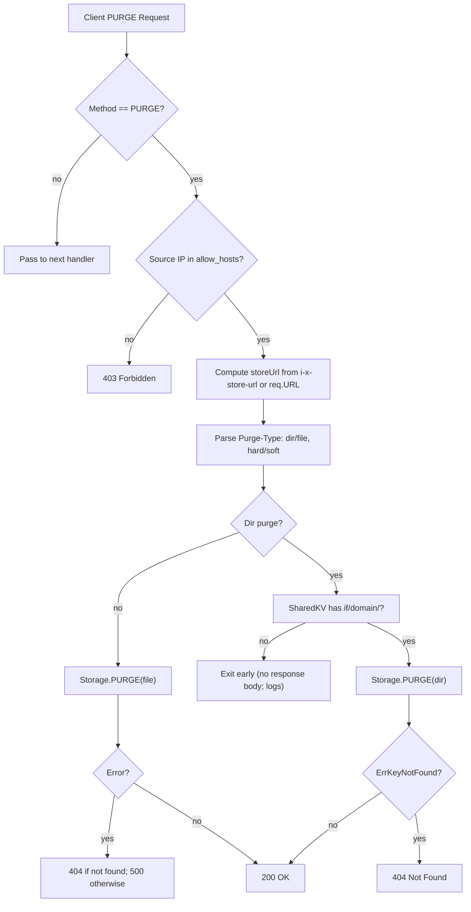
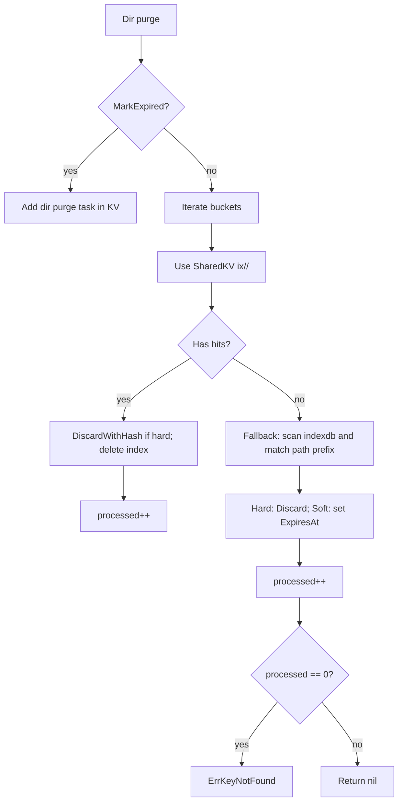

# PURGE Design

Tavern implements cache invalidation via a `purge` plugin plus storage-layer primitives that support both single-object and directory purges. This document details configuration, request semantics, internal flow, storage behavior, and known caveats.

## Overview

- Purpose: Invalidate cached content by URL or by directory prefix.
- Entry point: PURGE HTTP requests intercepted by the `purge` plugin and translated into storage operations.
- Modes:
  - File purge: target a single cached object.
  - Directory purge: target all cached objects whose `storeUrl` path shares a prefix.
- Strategies:
  - Hard: delete cached file(s).
  - MarkExpired: set past expiry to trigger revalidation on next access.

## Configuration

Enable the plugin and set options in `config.yaml`:

```yaml
plugins:
  - name: purge
    options:
      allow_hosts:
        - "127.0.0.1"
        - "::1"
      header_name: "Purge-Type"   # default: Purge-Type
      log_path: "logs/purge.log"  # optional
      threshold: 0                 # reserved for queue sizing/backpressure
```

Options:

- allow_hosts: IP allowlist; only requests from these source IPs may PURGE.
- header_name: header used to define purge type; default `Purge-Type`.
- log_path: optional plugin log file path.
- threshold: reserved; not currently used in request path.

## Request API

Send PURGE requests to the resource URL you want to invalidate.

- Method: PURGE
- URL: the target resource (absolute URL)
- Headers:
  - `Purge-Type`: controls mode and strategy
    - `file` (default): single-object purge.
    - `dir`: directory/prefix purge.
    - Append `,hard` to perform hard delete. Examples: `dir,hard`, `file,hard`.
  - `i-x-store-url` (optional): override the stored cache key URL used by storage.

Responses:

- 200 OK: purge executed successfully.
- 403 Forbidden: source IP not in allowlist.
- 404 Not Found: object(s) not present in cache.
- 500 Internal Server Error: internal error while processing purge.

Examples:

```bash
# Single file: mark-expired (soft)
curl -X PURGE http://example.com/static/js/main.js

# Single file: hard delete
curl -X PURGE -H "Purge-Type: file,hard" http://example.com/static/js/main.js

# Directory prefix: mark-expired
curl -X PURGE -H "Purge-Type: dir" http://example.com/static/js/

# Directory prefix: hard delete
curl -X PURGE -H "Purge-Type: dir,hard" http://example.com/static/js/

# Use internal store-url override
curl -X PURGE -H "i-x-store-url: http://example.com/static/js/" -H "Purge-Type: dir,hard" http://example.com/anything
```

## Internal Flow

Primary code paths:

- Plugin handler: [plugin/purge/purge.go](plugin/purge/purge.go)
- Storage implementation: [storage/storage.go](storage/storage.go)
- SharedKV implementation: [storage/sharedkv/kv_pebble.go](storage/sharedkv/kv_pebble.go)
- Internal header definitions: [internal/constants/global.go](internal/constants/global.go)

### Plugin: request handling

1. Accept only `PURGE` method; otherwise pass through to next handler.
2. Extract source IP from `RemoteAddr`; enforce allowlist (`allow_hosts`).
3. Compute `storeUrl`:
   - Prefer `i-x-store-url` (`InternalStoreUrl`); otherwise `req.URL.String()`.
4. Parse `Purge-Type` header:
   - First token: `dir` for directory, otherwise file.
   - Second token: `hard` → hard delete; default is soft (MarkExpired).
5. Log request and look up current storage via `storage.Current()`.
6. For directory purge:
   - If no domain counter exists for `u.Host` in SharedKV key `if/domain/<host>`, log and exit early.
   - Call `storage.PURGE(storeUrl, ctrl)` and translate errors to HTTP status (404 for `ErrKeyNotFound`, 500 otherwise).
7. For file purge: call `storage.PURGE()` and translate errors as above.
8. On success, respond `200` with `{"message":"success"}`.

### Storage: purge behavior

File purge:

- Resolve `bucket` via selector on `object.ID(storeUrl)`.
- Hard: `bucket.Discard(id)`.
- Soft (MarkExpired): `bucket.Lookup(id)`, set `ExpiresAt` to a past timestamp, and `bucket.Store(md)`.

Directory purge:

- When `Hard` or soft-but-not-MarkExpired:
  - Prefer SharedKV inverted index for fast targeting:
    - Index key schema: `ix/<bucketID>/<storeUrl>`.
    - Value: `object.IDHash` bytes (fixed size).
  - Iterate buckets:
    - For each inverted-index hit: delete file by hash (`DiscardWithHash`) if hard; delete-index mapping; count processed.
  - Fallback scan when no index hits:
    - Iterate bucket metadata; for any `md.ID.Path()` prefixed by `storeUrl`, delete (hard) or mark-expired (soft), and count processed.
  - If processed is zero: return `ErrKeyNotFound`.
- When `Dir` with `MarkExpired` set:
  - Current implementation returns `nil` immediately (no changes). See Caveats.

SharedKV keys used by PURGE:

- `if/domain/<host>`: domain counter (presence used by plugin to gate dir purges).
- `ix/<bucketID>/<storeUrl>`: inverted index mapping to object hashes for efficient dir purges.

## Flowchart



Storage.PURGE(dir) detail:



## Caveats & Notes

- Dir purge with `MarkExpired`: The current storage implementation returns success (`nil`) without marking entries expired. The comment suggests a fallback full scan for soft purges but is not executed due to the early return. If you rely on soft dir purge, consider using `dir,hard` or update the implementation.
- Plugin response for dir purge when the `if/domain/<host>` counter is missing: the handler logs and returns without writing a response body; clients may see a `200` or connection close depending on upstream wrapping. Validate behavior in your deployment.
- Inverted index population: Ensure your storage buckets populate `ix/<bucketID>/<storeUrl>` keys to leverage fast dir purges; otherwise the fallback scan is used.

## Operational Guidance

- Use `allow_hosts` to restrict purge sources to trusted control planes.
- Prefer `hard` for immediate deletions when correctness is paramount; use soft (MarkExpired) to trigger revalidation while retaining metadata.
- For large dir purges, ensure SharedKV is healthy; fallback scans may be expensive.

## Related Files

- [plugin/purge/purge.go](plugin/purge/purge.go)
- [storage/storage.go](storage/storage.go)
- [internal/constants/global.go](internal/constants/global.go)
- [storage/sharedkv/kv_pebble.go](storage/sharedkv/kv_pebble.go)
