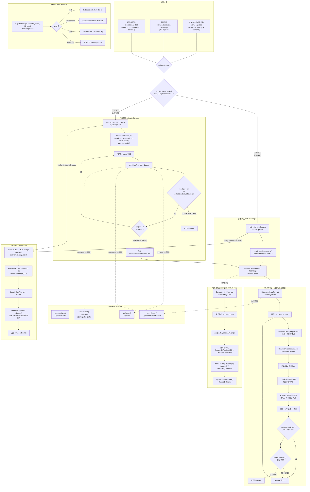

# Storage Select 完整流程

本文档详细描述 Tavern 存储层 `Select` 方法的完整调用链路、数据结构与核心算法。

---

## 1. 调用入口

Select 被调用的场景有三个：

| 入口 | 位置 | 说明 |
|------|------|------|
| 缓存中间件 | `server/middleware/caching/processor.go:103` | 需要读写缓存对象时，通过 `object.ID` 找到对应的 Bucket |
| 全局函数 | `storage/global.go:30` | 持有全局 `defaultStorage` 的锁，代理调用 |
| PURGE 删除 | `storage/storage.go:220` | 单对象删除时，先 Select 再 Discard |

```go
// 缓存中间件调用
bucket := store.Select(req.Context(), objectID)

// 全局函数调用
bucket := storage.Select(ctx, cacheKey)
```

---

## 2. 完整流程图



---

## 3. 两大模式对比

| 模式 | 条件 | 实现结构体 | 核心逻辑 |
|------|------|-----------|---------|
| **普通模式** | `Migration.Enabled = false` | `nativeStorage` | 直接委托给 warmSelector（一致性哈希），不检查对象是否存在 |
| **迁移模式** | `Migration.Enabled = true` | `migratorStorage` | Hot → Warm → Cold 链式查找，逐层调用 `bucket.Exist()` 检查对象是否存在 |

### 3.1 普通模式 (`nativeStorage`)

```go
// storage/storage.go:136
func (n *nativeStorage) Select(ctx context.Context, id *object.ID) storage.Bucket {
    bucket := n.selector.Select(ctx, id)
    return bucket
}
```

极其简单：一行委托。`n.selector` 即 `warmSelector`，是一个哈希环选择器。

### 3.2 迁移模式 (`migratorStorage`)

```go
// storage/migrator.go:169
func (m *migratorStorage) Select(ctx context.Context, id *object.ID) storage.Bucket {
    return m.chainSelector(ctx, id,
        m.hotSelector,
        m.warmSelector,
        m.coldSelector,
    )
}
```

核心在 `chainSelector`：

```go
// storage/migrator.go:240
func (m *migratorStorage) chainSelector(ctx context.Context, id *object.ID, selectors ...storage.Selector) storage.Bucket {
    for _, sel := range selectors {
        if sel == nil {
            continue
        }
        if bucket := sel.Select(ctx, id); bucket != nil && bucket.Exist(ctx, id.Bytes()) {
            return bucket
        }
    }
    // 兜底: 返回 warmSelector 的结果
    return m.warmSelector.Select(ctx, id)
}
```

**关键差异**：迁移模式不仅做哈希定位，还会调用 `bucket.Exist()` 检查对象是否真的在该 Bucket 的 IndexDB 中。这是为了支持对象的 **Promote/Demote** 跨层迁移：

- **Promote**：Cold → Warm → Hot（访问量上升）
- **Demote**：Hot → Warm → Cold（访问量下降）

### 3.3 按层选择 (`SelectLayer`)

```go
// storage/migrator.go:220
func (m *migratorStorage) SelectLayer(ctx context.Context, id *object.ID, layer string) storage.Bucket {
    switch layer {
    case storage.TypeHot:
        if m.hotSelector != nil {
            return m.hotSelector.Select(ctx, id)
        }
    case storage.TypeNormal, storage.TypeWarm:
        if m.warmSelector != nil {
            return m.warmSelector.Select(ctx, id)
        }
    case storage.TypeCold:
        if m.coldSelector != nil {
            return m.coldSelector.Select(ctx, id)
        }
    case storage.TypeInMemory:
        return m.memoryBucket
    }
    return nil
}
```

用于迁移操作（Promote/Demote）时，根据目标层直接定位到对应 Bucket。

---

## 4. HashRing 一致性哈希（核心算法）

### 4.1 选择器工厂

```go
// storage/selector/selector.go:12
func New(buckets []storage.Bucket, typ string) storage.Selector {
    curr, err := hashring.New(buckets, hashring.WithReplicas(20))
    if err != nil {
        panic(err)
    }
    return curr
}
```

目前仅支持 `hashring` 类型，`typ` 参数实际未使用。

### 4.2 Balancer.Select 算法

```go
// storage/selector/hashring/hashring.go:43
func (b *Balancer) Select(ctx context.Context, id *object.ID) storage.Bucket {
    for i := 1; i <= len(b.buckets); i++ {
        groups, err := b.hashring.GetN(string(id.Bytes()), i)
        if err != nil {
            return nil
        }
        bucket := groups[i-1].(storage.Bucket)
        if bucket.UseAllow() {
            if bucket.HasBad() {
                continue
            }
            return bucket
        }
    }
    return nil
}
```

**算法步骤**：

1. `i=1` 开始，每次递增，调用 `GetN(key, i)` 获取 i 个最近节点
2. 取第 `i-1` 个（最后一个，即第 i 近的）节点
3. 检查 `UseAllow()`（允许百分比）和 `HasBad()`（健康状态）
4. 如果满足条件则返回，否则 `i++` 找下一个更远的节点
5. 这是一种**退避策略**：优先返回最近的健康节点

### 4.3 Consistent.GetN — 哈希环查找

```go
// storage/selector/hashring/consistent.go:173
func (c *Consistent) GetN(name string, n int) ([]Node, error) {
    key := c.hashKey(name)         // FNV-32a 哈希
    i := c.search(key)             // 二分搜索定位
    // 从起始位置顺时针遍历，收集 n 个不重复节点
    // ...
}
```

**关键参数**：

| 参数 | 值 | 说明 |
|------|-----|------|
| 哈希函数 | FNV-32a | `hash/fnv` 标准库 |
| 虚拟副本数 | 20 | `NumberOfReplicas`，可通过 `WithReplicas` 配置 |
| 虚拟节点 key | `"{idx}|{weight}|{bucketID}"` | 每个副本 × 每个权重单位生成一个虚拟节点 |

### 4.4 哈希环构建

```go
// storage/selector/hashring/consistent.go:109
func (c *Consistent) Set(caches []Node) {
    // 移除不再存在的节点
    // 新增节点: add(cache, cache.Weight())
    //   → NumberOfReplicas × Weight 个虚拟节点
    //   → 每个虚拟节点: circles[hash("{idx}|{weight}|{id}")] = bucket
    // updateSortedHashes() → sort
}
```

**总虚拟节点数** = `∑(20 × Bucket.Weight)`，例如 3 个 Bucket 各权重 10 → 600 个虚拟节点。

---

## 5. DirAware 目录感知包装

当 `config.DirAware.Enabled = true` 时，`nativeStorage` 或 `migratorStorage` 被 `wrappedStorage` 包装。

```go
// storage/diraware/storage.go:34
func (w *wrappedStorage) Select(ctx context.Context, id *object.ID) storagev1.Bucket {
    return wrapBucket(w.base.Select(ctx, id), w.checker)
}
```

### 5.1 Bucket 包装 — Lookup 注入

```go
// storage/diraware/bucket.go:26
func (b *wrappedBucket) Lookup(ctx context.Context, id *object.ID) (*object.Metadata, error) {
    md, err := b.base.Lookup(ctx, id)
    if err != nil || md == nil {
        return md, err
    }
    marked, err := b.checker.Marked(ctx, id, md)
    if marked {
        md.ExpiresAt = time.Now().Add(-1 * time.Second).Unix()
    }
    return md, nil
}
```

### 5.2 Checker 标记逻辑

```go
// storage/diraware/diraware.go:74
func (c *checker) Marked(ctx context.Context, id *object.ID, md *object.Metadata) (bool, error) {
    unix, found := c.pathtrie.Search(id.Path())
    if found && md.RespUnix <= unix {
        return true, nil  // 对象在推送目录任务之前保存的 → 标记过期
    }
    return false, nil
}
```

**逻辑**：前缀树（PathTrie）中存储了被推送的目录路径及推送时间。当 `Lookup` 时，如果对象所在路径被推送标记过，且对象的最后修改时间 ≤ 推送时间，说明这个对象是在推送之前缓存的，应当标记为过期。

---

## 6. 各 Selector 覆盖的 Bucket 范围

| Selector | 管理的 Bucket 列表 | 对应 StoreType |
|----------|-------------------|----------------|
| `warmSelector` | `warmBucket[]` | `TypeWarm` / `TypeNormal`（Normal 自动别名为 Warm） |
| `hotSelector` | `hotBucket[]` | `TypeHot`（仅 migrator 模式） |
| `coldSelector` | `coldBucket[]` | `TypeCold`（仅 migrator 模式） |
| `memoryBucket` | 单例 | `TypeInMemory`（直接引用，不走哈希环） |

### 6.1 Bucket 初始化时的分类

```go
// storage/storage.go:104 (reinit 方法)
switch bucket.StoreType() {
case storage.TypeNormal, storage.TypeWarm:
    n.warmlBucket = append(n.warmlBucket, bucket)
case storage.TypeHot:
    n.hotBucket = append(n.hotBucket, bucket)
case storage.TypeInMemory:
    n.memoryBucket = bucket  // 只能有一个
case storage.TypeCold:       // 仅 migrator
    m.coldBucket = append(m.coldBucket, bucket)
}
```

> **注意**：`TypeNormal` 在 `mergeConfig` 中会被自动转为 `TypeWarm`（`storage/builder.go:61`）。

---

## 7. 关键接口定义

```go
// api/defined/v1/storage/storage.go

type Selector interface {
    Select(ctx context.Context, id *object.ID) Bucket
    Rebuild(ctx context.Context, buckets []Bucket) error
}

type Storage interface {
    io.Closer
    Selector                           // 内嵌 Selector
    Buckets() []Bucket
    SharedKV() SharedKV
    PURGE(storeUrl string, typ PurgeControl) error
}

type Migrator interface {
    Storage                            // 内嵌 Storage
    SelectLayer(ctx context.Context, id *object.ID, layer string) Bucket
}
```

完整实现矩阵：

| 接口 | `nativeStorage` | `migratorStorage` | `wrappedStorage` (diraware) |
|------|:---:|:---:|:---:|
| `Storage` | ✓ | ✓ | ✓ |
| `Migrator` | ✗ | ✓ | ✗ |
| `Select()` | 委托 warmSelector | chainSelector(Hot→Warm→Cold) | 包装 base.Select() |
| `SelectLayer()` | N/A | 按层直接选择 | N/A |

---

## 8. 文件索引

| 文件 | 内容 |
|------|------|
| `api/defined/v1/storage/storage.go` | `Selector`、`Storage`、`Migrator`、`Bucket` 接口定义 |
| `storage/global.go` | 全局 `Select()`、`SetDefault()`、`Current()` |
| `storage/storage.go` | `nativeStorage` 实现（普通模式） |
| `storage/migrator.go` | `migratorStorage` 实现（迁移模式） |
| `storage/builder.go` | `NewBucket()` 工厂、配置合并 |
| `storage/selector/selector.go` | Selector 工厂（目前仅 hashring） |
| `storage/selector/hashring/hashring.go` | `Balancer.Select()` 算法 |
| `storage/selector/hashring/consistent.go` | 一致性哈希环实现 |
| `storage/diraware/storage.go` | DirAware Storage 包装器 |
| `storage/diraware/bucket.go` | DirAware Bucket 包装器（Lookup 注入） |
| `storage/diraware/diraware.go` | Checker 实现（PathTrie + SharedKV） |
