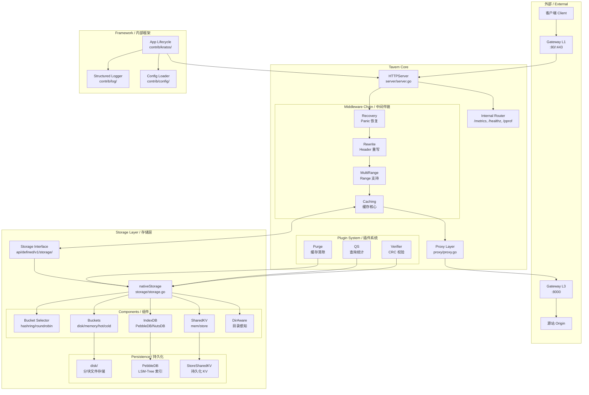
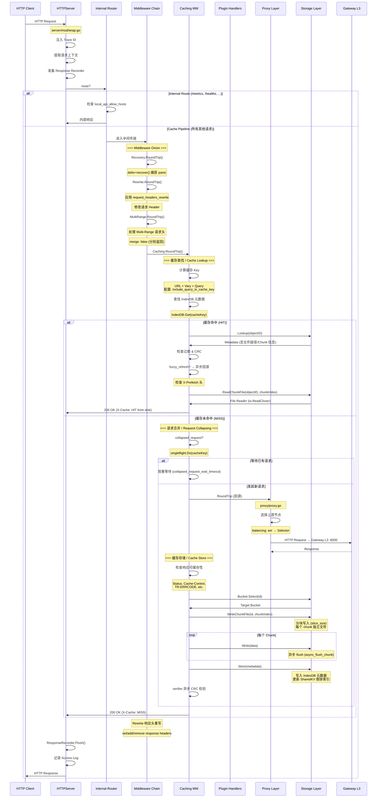
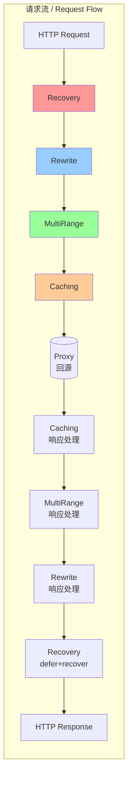
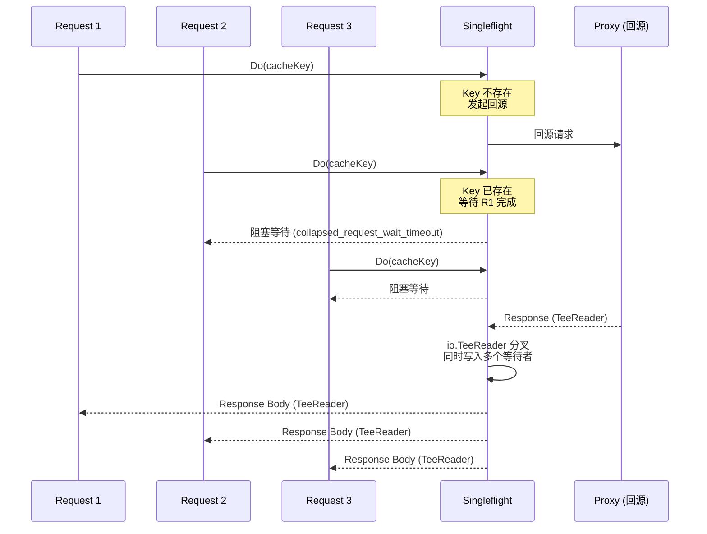
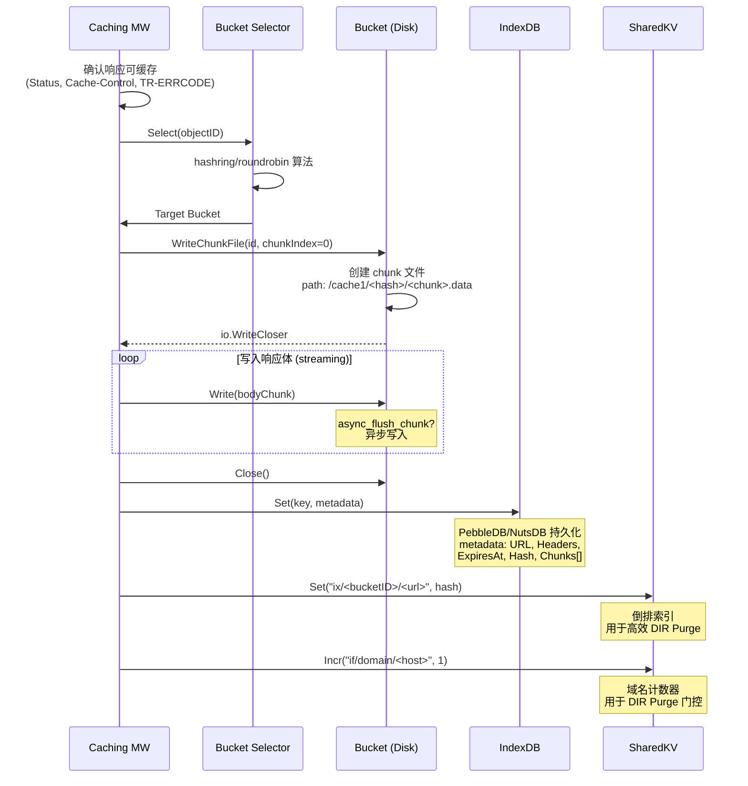
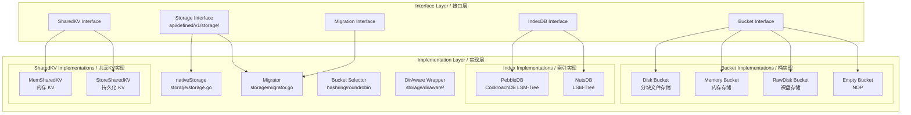
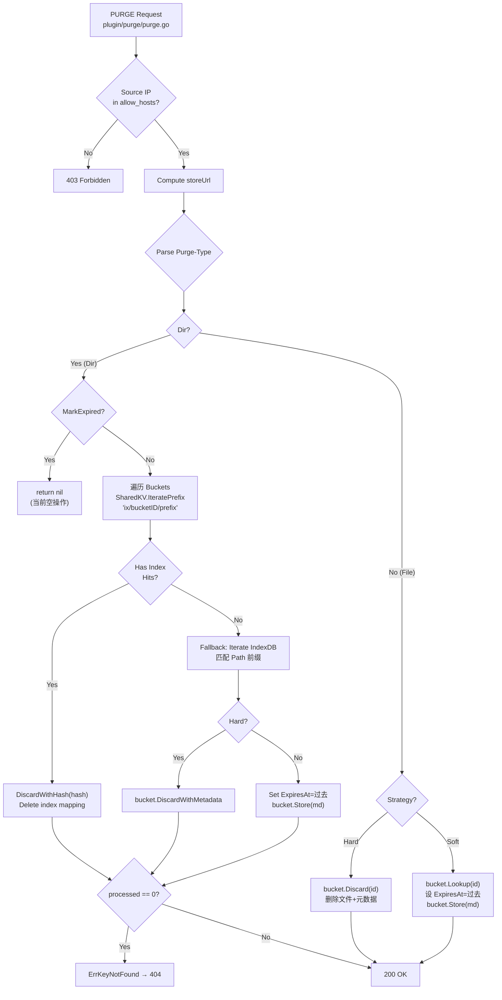
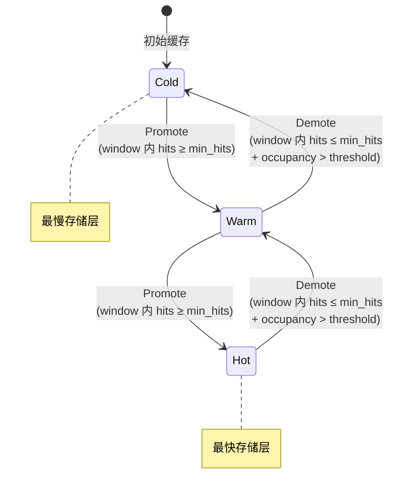
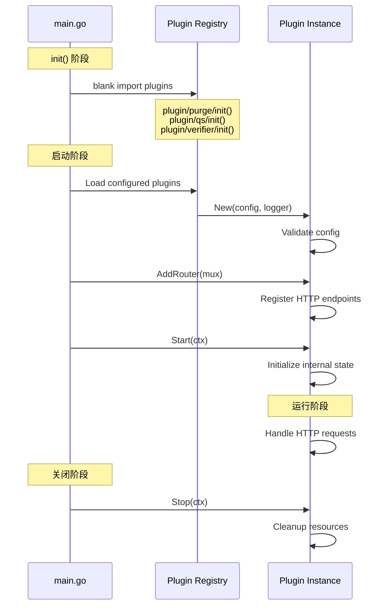

# Tavern 架构文档 / Tavern Architecture Documentation

> 本文档深入描述 Tavern (L2 Cache) 的内部架构、组件设计、数据流和核心算法的实现细节。
> 所有代码路径引用使用 `file.go:line` 格式。

---

## 1. 整体架构 / Overall Architecture



---

## 2. 请求生命周期 / Request Lifecycle

### 2.1 完整时序图 / Full Sequence Diagram



### 2.2 关键代码路径 / Key Code Paths

| 步骤 / Step | 文件 / File | 函数 / Function |
|:---|:---|:---|
| 请求填充 / Request Filling | `server/mod/wrap.go` | `RequestFiller` |
| 追踪注入 / Trace Injection | `server/mod/wrap.go` | `InjectTrace` |
| 响应记录 / Response Recording | `server/mod/wrap.go` | `ResponseRecorder` |
| 中间件链执行 / Middleware Chain | `server/middleware/middleware.go` | `Chain()` |
| 缓存 Key 计算 / Cache Key | `server/middleware/caching/caching.go` | `cacheKey()` |
| 缓存查找 / Cache Lookup | `server/middleware/caching/caching.go` | `lookup()` |
| 请求合并 / Request Collapsing | `server/middleware/caching/locker.go` | `collapsedRequest()` |
| 回源 / Origin Fetch | `proxy/proxy.go` | `RoundTrip()` |
| 上游选择 / Upstream Select | `proxy/proxy.go` | `selectNode()` |
| 缓存写入 / Cache Store | `server/middleware/caching/processor.go` | `store()` |
| 响应返回 / Response | `server/middleware/caching/caching.go` | `RoundTrip()` |

---

## 3. 中间件链 / Middleware Chain

### 3.1 洋葱模型 / Onion Model



### 3.2 中间件接口定义 / Middleware Interface

**文件：** `server/middleware/middleware.go`

```go
// Middleware 是一个处理函数，包装一个 http.RoundTripper 返回新的 http.RoundTripper
type Middleware func(http.RoundTripper) http.RoundTripper

// Factory 是中间件工厂函数
type Factory func(*configv1.Middleware) (middleware Middleware, cleanup func(), err error)

// Chain 将多个 Middleware 组合成一个链
// 执行顺序：m[0] 在最外层，最后注册的在内层
func Chain(m ...Middleware) Middleware {
    return func(next http.RoundTripper) http.RoundTripper {
        for i := len(m) - 1; i >= 0; i-- {
            next = m[i](next)
        }
        return next
    }
}
```

**注册机制：**

```go
// server/middleware/registry.go
var registry = map[string]Factory{}

func RegisterFactory(name string, f Factory) {
    registry[name] = f
}

// 各中间件包 init() 中自动注册
// server/middleware/caching/ → init() → RegisterFactory("caching", factory)
// server/middleware/recovery/ → init() → RegisterFactory("recovery", factory)
```

### 3.3 各中间件详解 / Middleware Details

#### 3.3.1 Recovery — Panic 恢复

**文件：** `server/middleware/recovery/recovery.go`

```go
func (r *recovery) RoundTrip(req *http.Request) (*http.Response, error) {
    defer func() {
        if err := recover(); err != nil {
            // 记录 panic 栈信息
            // 返回 500 响应
        }
    }()
    return r.next.RoundTrip(req)
}
```

**配置：**
- `fail_count_threshold`: 时间窗口内 panic 次数阈值
- `fail_window`: 统计窗口（秒），超阈值后熔断

#### 3.3.2 Rewrite — Header 重写

**文件：** `server/middleware/rewrite/rewrite.go`

**操作类型：**
- `set`: 覆盖设置 Header
- `add`: 追加 Header（可多次）
- `remove`: 删除 Header

**执行时机：**
- 请求方向：在调用 `next.RoundTrip(req)` 前修改 `req.Header`
- 响应方向：在获得响应后修改 `resp.Header`

#### 3.3.3 MultiRange — 多区间支持

**文件：** `server/middleware/multirange/multirange.go`

```go
type MultiRange struct {
    merge bool  // 是否合并多个 range 为单一响应
}
```

**行为：**
- `merge: false` (默认): 每个 Range 返回独立的 Part
- 处理 `Range: bytes=0-100,200-300` 格式

#### 3.3.4 Caching — 缓存核心

**文件：** `server/middleware/caching/` (15+ 文件)

这是最复杂的中间件。详见下节。

---

## 4. 缓存中间件深度分析 / Caching Middleware Deep Dive

### 4.1 文件组成 / File Structure

```
server/middleware/caching/
├── caching.go              # 主入口: RoundTrip, cacheKey, lookup
├── processor.go            # 缓存处理器: preCacheProcessor, storeProcess
├── caching_state.go        # 缓存状态管理: Caching struct
├── caching_prefetch.go     # 预取逻辑
├── caching_vary.go         # Vary 多版本处理
├── caching_fillrange.go    # Range 填充
├── caching_fuzzy_test.go   # 模糊刷新
├── caching_revalidate.go   # 异步回源校验
├── caching_chunkpart_test.go # Chunk 分块测试
├── caching_filechanged.go  # 文件变更检测
├── internal.go             # 内部工具函数
├── internal_checksum.go    # CRC/xxhash 校验
├── locker.go               # 请求合并锁
└── metrics.go              # 缓存层 Prometheus 指标
```

### 4.2 缓存 Key 计算 / Cache Key Computation

```go
// 缓存 Key 由以下因素决定:
cacheKey = hash(
    req.URL.String(),           // 完整 URL
    + include_query_in_cache_key  // 是否包含查询参数
    + vary_headers                // Vary 头值
    + vary_ignore_key             // 排除的 Vary 头列表
)
```

**配置影响：**
- `include_query_in_cache_key: true` → `/path?a=1` 和 `/path?a=2` 视为不同资源
- `vary_ignore_key: ["Cookie"]` → 忽略 Cookie 变化，避免版本爆炸

### 4.3 请求合并流程 / Request Collapsing Flow



**实现：** `proxy/singleflight/`

```go
// 自定义 singleflight (非标准库)，支持:
// - io.TeeReader: 将回源响应体同时发送给所有等待者
// - 超时控制: collapsed_request_wait_timeout
// - context 取消传播
```

### 4.4 缓存写入流程 / Cache Store Flow



### 4.5 异步校验 (Revalidation) / Async Revalidation

**触发条件：**
1. 缓存对象已过期 (ExpiresAt < Now)
2. Fuzzy Refresh 触发

**流程：**
```go
// server/middleware/caching/caching_revalidate.go
func (c *Caching) revalidate(req, cachedMeta) {
    // 1. 发起异步回源请求 (带 If-None-Match / If-Modified-Since)
    // 2. 源站 304 → 更新 ExpiresAt，不清除缓存内容
    // 3. 源站 200 → 替换缓存内容
    // 4. 等待期间: 继续使用过期缓存版本 (stale-while-revalidate)
}
```

### 4.6 文件变更检测 / File Change Detection

**文件：** `server/middleware/caching/caching_filechanged.go`

**行为：**
- 缓存响应时记录 `ETag` 和 `Last-Modified`
- 下次回源校验时对比，检测源站文件是否已变更
- EdgeMode: 比较 CRC checksum

---

## 5. 存储层架构 / Storage Layer Architecture

### 5.1 分层架构图 / Layered Architecture



### 5.2 核心接口定义 / Core Interface Definitions

#### Storage 接口

**文件：** `api/defined/v1/storage/storage.go:55-64`

```go
type Storage interface {
    io.Closer
    Selector                                    // 桶选择

    Buckets() []Bucket                          // 获取所有桶
    SharedKV() SharedKV                         // 共享 KV 存储
    PURGE(storeUrl string, typ PurgeControl) error  // 缓存清除
}
```

#### Bucket 接口

**文件：** `api/defined/v1/storage/storage.go:80-104`

```go
type Bucket interface {
    io.Closer
    Operation                                    // 对象操作 (Lookup, Store, Discard...)

    ID() string                                  // 桶 ID
    Weight() int                                 // 权重 (0-1000)
    Allow() int                                  // 允许使用比例 (0-100)
    UseAllow() bool
    Objects() uint64                             // 对象总数
    HasBad() bool                                // 是否异常
    Type() string                                // 桶类型 (disk/memory/rawdisk/empty)
    StoreType() string                           // 存储分层 (hot/cold/warm)
    Path() string                                // 存储路径
    TopK(k int) []string                         // TopK 热门 Key
}
```

#### Operation 接口

**文件：** `api/defined/v1/storage/storage.go:20-53`

```go
type Operation interface {
    Lookup(ctx, id) (*object.Metadata, error)
    Touch(ctx, id)
    Store(ctx, meta) error
    Exist(ctx, id) bool
    Remove(ctx, id) error                        // 软删除
    Discard(ctx, id) error                       // 硬删除
    DiscardWithHash(ctx, hash) error             // 按 Hash 硬删除
    DiscardWithMessage(ctx, id, msg) error       // 带消息删除
    DiscardWithMetadata(ctx, meta) error         // 按 Metadata 删除
    Iterate(ctx, fn) error
    Expired(ctx, id, md) bool
    WriteChunkFile(ctx, id, index) (io.WriteCloser, string, error)
    ReadChunkFile(ctx, id, index) (File, string, error)
    Migrate(ctx, id, dest) error                 // 迁移到目标桶
    SetMigration(m) error
}
```

#### IndexDB 接口

**文件：** `api/defined/v1/storage/indexdb.go:25-57`

```go
type IndexDB interface {
    io.Closer
    Get(ctx, key) (*object.Metadata, error)      // 获取元数据
    Set(ctx, key, val) error                     // 存储元数据
    Exist(ctx, key) bool                         // 检查存在
    Delete(ctx, key) error                       // 删除
    Iterate(ctx, prefix, fn) error               // 前缀遍历
    Expired(ctx, fn) error                       // 过期条目遍历
    GC(ctx) error                                // 垃圾回收
}
```

#### SharedKV 接口

**文件：** `api/defined/v1/storage/storage.go:126-147`

```go
type SharedKV interface {
    io.Closer
    Get(ctx, key) ([]byte, error)
    Set(ctx, key, val) error
    Incr(ctx, key, delta) (uint32, error)        // 原子递增
    Decr(ctx, key, delta) (uint32, error)        // 原子递减
    GetCounter(ctx, key) (uint32, error)
    Delete(ctx, key) error
    DropPrefix(ctx, prefix) error                // 按前缀批量删除
    Iterate(ctx, fn) error                       // 全量遍历
    IteratePrefix(ctx, prefix, fn) error         // 按前缀遍历
}
```

### 5.3 nativeStorage 实现 / nativeStorage Implementation

**文件：** `storage/storage.go`

```go
type nativeStorage struct {
    closed       bool
    mu           sync.Mutex
    log          *log.Helper

    selector     storage.Selector        // 桶选择器 (hashring/roundrobin)
    sharedkv     storage.SharedKV        // 跨桶 KV 存储
    nopBucket    storage.Bucket          // 空桶 (后备)
    memoryBucket storage.Bucket          // 内存桶 (仅限一个)
    hotBucket    []storage.Bucket        // 热数据桶
    warmlBucket  []storage.Bucket        // 暖数据桶 (主存储)
}
```

**初始化流程：**
```
New(config, logger)
  ├─ FillDefault() ← 填充配置默认值
  ├─ Migration enabled? → NewMigrator(config, logger)
  ├─ Create buckets (按配置)
  │   ├─ warm/normal → warmlBucket[]
  │   ├─ hot → hotBucket[]
  │   └─ memory → memoryBucket (唯一)
  ├─ Create selector (hashring/roundrobin)
  ├─ DirAware enabled?
  │   └─ Replace SharedKV with StoreSharedKV (持久化)
  │   └─ Wrap with diraware.New(n, checker)
  └─ Return Storage
```

### 5.4 分块文件存储 / Chunked File Storage

**磁盘桶实现：** `storage/bucket/disk/disk.go`

```
/cache1/
├── <hash_prefix>/
│   ├── <hash>/
│   │   ├── 0000000000.chunk    # 第 0 个 chunk (slice_size bytes)
│   │   ├── 0000000001.chunk    # 第 1 个 chunk
│   │   ├── 0000000002.chunk    # 第 2 个 chunk
│   │   └── ...
│   └── .indexdb/               # 该桶的 IndexDB
└── .diraware/                  # DirAware KV 存储
```

**分块策略：**
- `slice_size` (默认 1MB): 每个 chunk 文件的最大字节数
- 大文件自动跨多个 chunk
- Range 请求可以部分命中 (PART_HIT: 某些 chunk 已缓存)

### 5.5 PURGE 流程详解 / PURGE Flow Detail



### 5.6 冷热迁移状态机 / Tiering State Machine



---

## 6. 代理层 / Proxy Layer

### 6.1 架构

**文件：** `proxy/proxy.go`

```
Proxy Layer
├── Upstream Selector (omalloc/proxy)
│   ├── WRR (Weighted Round Robin)
│   └── Once (固定选择)
├── Connection Pool
│   ├── Per-address http.Client
│   ├── max_idle_conns / max_idle_conns_per_host
│   └── max_connections_per_server
├── Transport
│   ├── TCP
│   └── Unix Socket
└── Singleflight
    └── Request coalescing on cache misses
```

### 6.2 上游节点选择 / Upstream Node Selection

```go
// proxy/proxy.go
func (p *Proxy) RoundTrip(req *http.Request) (*http.Response, error) {
    // 1. 检查是否有动态 TR-UPS-ADDR 头（L1/L2 指定）
    if upsAddr := req.Header.Get("X-Ups-Addr"); upsAddr != "" {
        req.URL.Host = upsAddr
    }

    // 2. 通过 selector 选择上游节点
    node := p.selector.Select(req.Context(), req.URL)

    // 3. 从连接池获取对应地址的 http.Client
    client := p.getClient(node.Address)

    // 4. 发起请求
    return client.Do(req)
}
```

---

## 7. 插件系统 / Plugin System

### 7.1 插件接口 / Plugin Interface

**文件：** `api/defined/v1/plugin/`

```go
type Plugin interface {
    // 注册 HTTP 路由
    AddRouter(r *http.ServeMux) error
    // 注册 HTTP Handler（在中间件链之后）
    HandleFunc(pattern string, handler func(http.ResponseWriter, *http.Request))
    // 生命周期
    Start(ctx context.Context) error
    Stop(ctx context.Context) error
}
```

### 7.2 插件生命周期 / Plugin Lifecycle



### 7.3 内置插件详情 / Built-in Plugins

#### Purge 插件 / Purge Plugin

**文件：** `plugin/purge/purge.go`

| 特性 / Feature | 详情 / Detail |
|:---|:---|
| **HTTP 方法** | 仅处理 `PURGE` 方法 |
| **IP 白名单** | `allow_hosts` — 非白名单返回 403 |
| **Purge-Type 解析** | `file` / `dir` + `,hard` 后缀 |
| **Store URL 覆盖** | 通过 `i-x-store-url` 头自定义存储 Key |
| **错误处理** | 404 (对象不存在), 500 (内部错误), 200 (成功) |

#### QS (Query Stats) 插件 / QS Plugin

**文件：** `plugin/qs/`

| 特性 / Feature | 详情 / Detail |
|:---|:---|
| **SSE 端点** | 实时推送缓存统计数据 |
| **TopK 跟踪** | 追踪热门 URL (LRU TopK) |
| **指标导出** | `/metrics` 端点 (CPU, 内存, 请求速率) |
| **RPS 平滑** | 加权平滑请求速率计算 |
| **ttop 集成** | 为 `ttop` CLI 工具提供 SSE 数据源 |

#### Verifier 插件 / Verifier Plugin

**文件：** `plugin/verifier/`

| 特性 / Feature | 详情 / Detail |
|:---|:---|
| **Hash 算法** | xxhash (v1.1, 原为 md5) |
| **上报方式** | HTTP POST 到外部 CRC 校验服务 |
| **采样比例** | `report_ratio` (0-100%) |
| **异步执行** | 不阻塞缓存响应路径 |
| **超时控制** | `timeout` 秒 |

---

## 8. 内部框架 / Internal Framework

### 8.1 App 生命周期 / App Lifecycle

**文件：** `contrib/kratos/app.go`

```go
// Kratos-inspired App 生命周期
type App struct {
    opts     options
    ctx      context.Context
    cancel   func()
    instance *registry.ServiceInstance
}

func New(opts ...Option) *App

func (a *App) Run() error {
    // 1. Execute Start hooks (before)
    // 2. Handle OS signals (SIGINT, SIGTERM, SIGUSR2, SIGHUP)
    // 3. Execute Stop hooks (after)
}
```

**启动流程 (main.go):**
```
1. flag.Parse() ← 解析命令行参数
2. config.New(file.NewSource(flagConf)) ← 加载 YAML 配置
3. c.Scan(bc) ← 解析到 Bootstrap struct
4. log.NewHelper(logger) ← 初始化日志
5. storage.New(config.Storage, logger) ← 初始化存储
6. proxy.New(config.Upstream, logger) ← 初始化代理
7. plugin.LoadPlugins(config.Plugin) ← 加载插件
8. server.New(config.Server, ...) ← 创建 HTTP 服务器
9. app.Run() ← 启动应用生命周期
   ├─ tableflip.Upgrade() ← 平滑升级 (SIGUSR2)
   └─ graceful shutdown ← 优雅关闭 (SIGINT/SIGTERM)
```

### 8.2 配置系统 / Configuration System

**文件：** `contrib/config/`

```
Config Source (file/remote)
  → Provider (Watcher)
    → Scan to Bootstrap struct
      → Inject to components
```

**特性：**
- 支持 file provider (本地 YAML 文件)
- 支持 remote provider (远程配置, 可扩展)
- Change Watcher (配置变更监听)
- 配置合并与默认值填充

### 8.3 日志系统 / Logging System

**文件：** `contrib/log/`

| 特性 / Feature | 详情 / Detail |
|:---|:---|
| **结构化日志** | Key-Value 格式 |
| **日志轮转** | lumberjack (max_size, max_backups, max_age, compress) |
| **级别过滤** | debug / info / warn / error |
| **上下文传播** | Trace ID, Request ID |
| **调用者信息** | caller: true 输出文件名和行号 |

---

## 9. 相关文档 / Related Documents

- [Tavern 项目文档 / Tavern Project](./01-project.md)
- [Tavern 功能文档 / Tavern Features](./02-features.md)
- [生态概览 / Ecosystem Overview](../ecosystem/overview.md)
- [协议规范 / Protocol Specification](../ecosystem/protocol.md)
- [PURGE 设计 / PURGE Design](../purge.md)
- [CDN 缓存分析 / CDN Cache Analysis](../cdn-cache-analysis.md)

---

*Document generated: 2026-06-09 | Source: complete source code analysis of tavern repository*
